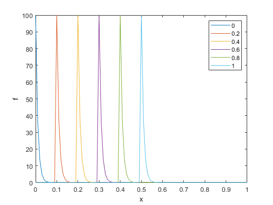

# PBM_Schemes
This repository contains scripts that can be used to explore the numerical solution of a variety of population balance models. Principally, three numerical schemes are considered: the Upwind, Lax-Wendroff and Leapfrog schemes. Further information can be found in the primary manuscript and supplementary information. 

## Model 1

We consider a population balance model of the form: 
<!-- $$
\frac{\partial f}{\partial t} + g\frac{\partial f}{\partial a} = 0 \ , \ f(t=0,a) = f_{0},
$$ -->


where  is the number density,   is time,  can potentially be the age or length or any other appropriate variable and  is a constant and positive growth rate. A Neumann boundary condition is imposed on the right boundary of the domain and a modified Dirichlet boundary condition on the left domain which specifies that cell at the ghost node on the left domain (i.e.  ) is 0. Refer to the main text for a more detailed explanation. 

On a separate script, the function can be called as follows: 

```
[f, stride_vec] = model_1(mesh,f0,0.5,0.5,"Upwind",[0,1],"output_style","stride", 20);
```

The various input and output arguments are outlined in the comments within the function script. The mesh and the values of should be precomputed and supplied accordingly. An example plot can be seen below: 



## Model 2

We consider a population balance model with a variable growth rate as follows: 


The boundaries of the domain are treated in the same manner as model 1. 

## Model 3

A non-homogeneous population balance model of the form is considered: 
$$
\frac{\partial f}{\partial t} + g\frac{\partial f}{\partial a} = \alpha(a)
$$


