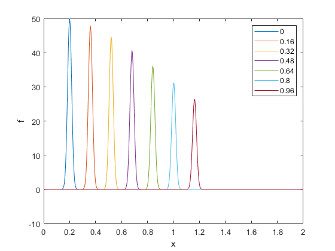

# PBM_Schemes
This repository contains scripts that can be used to explore the numerical solution of a variety of population balance models. Principally, three numerical schemes are considered: the Upwind, Lax-Wendroff and Leapfrog schemes. Further information can be found in the primary manuscript, supplementary information and within the actual scripts. 

## Model 1

We consider a population balance model of the form: 


where  is the number density,   is time,  can potentially be the age or length or any other appropriate variable and  is a constant and positive growth rate. A Neumann boundary condition is imposed on the right boundary of the domain and a modified Dirichlet boundary condition on the left domain which specifies that cell at the ghost node on the left domain (i.e.  ) is 0. Refer to the main text for a more detailed explanation. 

On a separate script, the function can be called as follows: 

```matlab
[f, stride_vec] = model_1(101,@(x)(1/0.01)*exp(-x./0.01),0.5,1.0,"Leapfrog",[0,1],[0,1],"output_style","stride",10);
```

The various input and output arguments are outlined in the comments within the function script. The mesh and the values of should be precomputed and supplied accordingly. 

An example plot can be seen below: 


## Model 2

We consider a population balance model with a variable growth rate as follows: 


The boundaries of the domain are treated in the same manner as model 1. 

As described in the manuscript, three model formulations were considered: 

1. Applying finite differencing directly on the equation on a uniform mesh (`model_2_conservative_uniform.m`)
2. Applying finite differencing on the conservative model formulation using a non-uniform mesh to enforce CFL = 1.0 at each point (`model_2_conservative_nonuniform.m`)
3. Applying finite differencing on the transformed model formulation with the non-uniform mesh from the second approach (`model_2_transformed_nonuniform.m`)
4. Applying the exact scheme presented in the manuscript (` model_2_exact.m`)

### Conservative, Uniform Grid

The first formulation can be employed as follows: 

```matlab
[f2,stride_vec2] = model_2_conservative_uniform(101,@(x)50*exp(-((x-0.2).^2)/0.0005), @(x)growth_rate(x), @(x)dudx(x), 1.0, "Upwind",[0,1],[0,1],"output_style","stride",20);
```

with the following associated functions for  and : 

```matlab
function u = growth_rate(mesh)
u = 0.1*4.34 + 0.06*4.34*mesh;
end

function uprime = dudx(mesh)
uprime = 0.06*4.34*ones(length(mesh),1);
end
```

### Conservative, Non-uniform Grid

The second formulation can be employed as follows: 

```matlab
[f3,mesh3, stride_vec3] = model_2_conservative_nonuniform(0.02,@(x)50*exp(-((x-0.2).^2)/0.0005),@(x)growth_rate(x),@(x)dudx(x), "Upwind", [0,1],[0,1],"output_stytle","stride",20);
```

Note that there is a difference in the input arguments. The function computes the mesh for a given  and . Correspondingly, the initial profile  should be inputted as a function handle as well. 

### Transformed, Non-uniform Grid

The implementation is similar to the previous case. 

```matlab
[f4,mesh4, stride_vec4] = model_2_transform_nonuniform(0.02,@(x)50*exp(-((x-0.2).^2)/0.0005),@(x)growth_rate(x),@(x)dudx(x), "Upwind", [0,1],[0,1],"output_stytle","stride",20);
```

### Exact Scheme

The exact scheme is a bit more involved as a few terms need to be evaluated beforehand. The function definition is as follows:

```matlab
function [f, mesh] = model_2_exact(N_cells, f0_transfun, ufun, zfun, xfun, x_vec, t_end)
```

- `f0_transfun` is given by: 
- `ufun` is 
- `zfun` is given by: 
- `xfun` is the inverse of `zfun`

The exact scheme can be used as follows

```matlab
[f5, mesh5] = model_2_exact(101, @(x)f0_transfun(x), @(x)growth_rate(x), @(x)(50/(3*4.34))*log(5+3*x), @(x)(exp((3*4.34/50)*x) -5)/3, [0,1], 1);
```

With the following function also added into the script:

```matlab
function f = f0_transfun(x)
f = (0.434 + 0.2604*x).*(50*exp(-((x-0.2).^2)/0.0005));
end
```

### Sample Plot

A sample plot can be seen below:


## Model 3

A non-homogeneous population balance model of the form is considered: 


The function can be used as follows:

```matlab
[f6,stride_vec6] = model_3(201,@(x)50*exp(-((x-0.2).^2)/0.0005),0.5,@(x)(1+(0.1*x)+(0.1*x.^2)),@(x)(0.1 + 0.2.*x),1.0,"Lax Wendroff",[0,1],[0,1],"output_style","stride",20);
```

### Sample Results


## Model 4

We consider a non-homogeneous model with a linear term as follows:


### Naïve Scheme

The straightforward finite difference scheme can be used as follows:

```matlab
[f7,stride_vec7] = model_4_naive(501,@(x)50*exp(-((x-0.2).^2)/0.0005), @(x)x, @(x)1,@(x)(0), 1.0, [0,1],[0,2], "Upwind", "output_style","stride",40);
```

### Exact Scheme

The exact scheme can be used as follows:

```matlab
[f8,stride_vec8] = model_4_exact(101,@(x)50*exp(-((x-0.2).^2)/0.0005),@(x)intk(x), @(x)(0), [0,1], [0,2],"output_style","stride",20);
```

with the following function included in the script to compute :

```matlab
function f = intk(x)
f = 0.5*(x.^2);
end
```

### Sample Results

